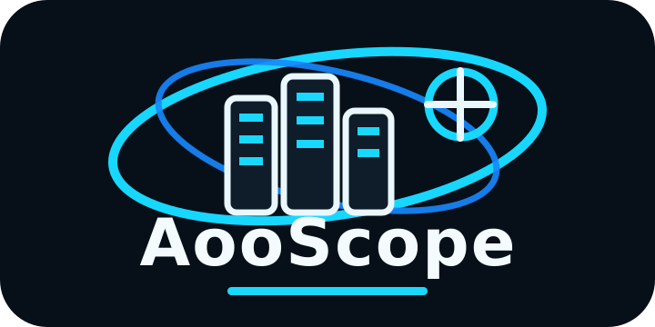
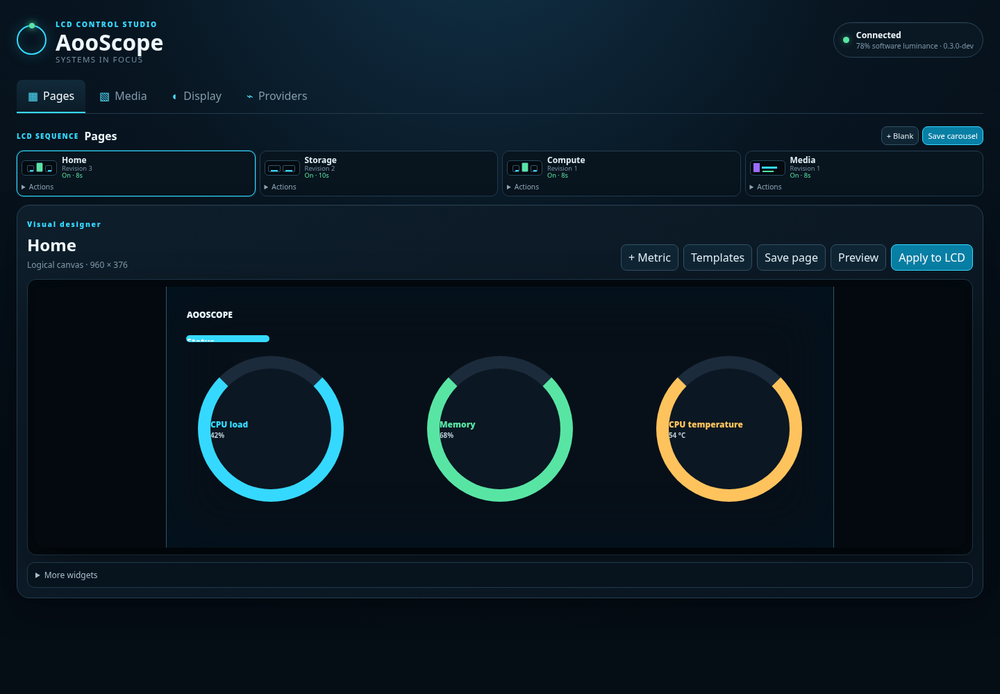
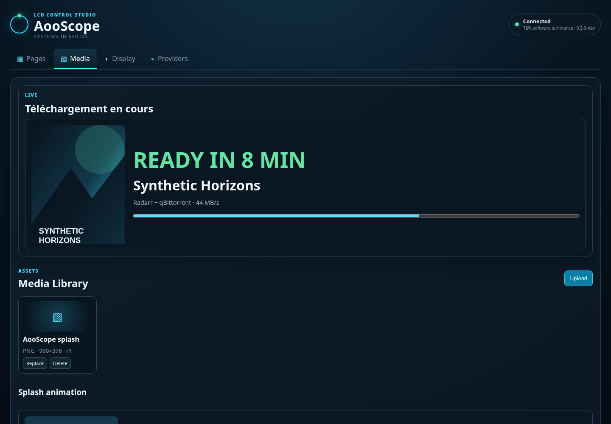
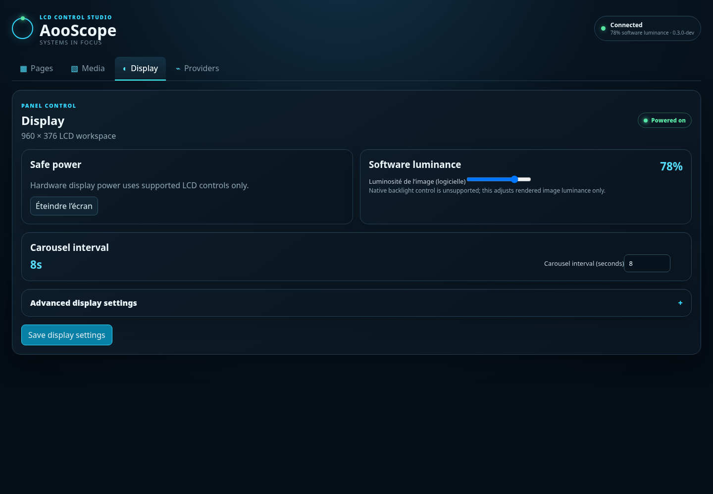

<p align="center">
  
</p>

<h1 align="center">AooScope — AOOSTAR WTR MAX LCD Dashboard</h1>

<p align="center"><strong>The open-source Linux dashboard for the AOOSTAR WTR MAX monitoring screen.</strong><br>
Turn the 960×376 front LCD into live Proxmox, storage, hardware and media telemetry.</p>

<p align="center">
  
  
  
  
  
</p>

<p align="center">🇫🇷 <a href="README.fr.md">README en français</a></p>

<p align="center">
  
</p>

AooScope is a community-built control studio for the **AOOSTAR WTR MAX** LCD. It replaces a tiny wall of monitoring text with glanceable pages: large values, rings and bars, adaptive disk health, Proxmox metrics, media posters and human ETAs such as **READY IN 8 MIN**.

The primary target is the **AOOSTAR WTR MAX 8845HS / WTR MAX NAS** running Linux, Proxmox or another Docker-capable homelab OS. Other AOOSTAR systems exposing the same supported serial LCD protocol may work too.

## Why AooScope

- **Made for the WTR MAX screen** — layouts are designed around the real 960×376 LCD workspace, not a desktop dashboard squeezed onto it.
- **Visual Studio, not config-file art** — drag, resize and bind friendly metrics from the browser; raw metric IDs stay in Advanced.
- **Adaptive storage pages** — detect disks, show used/total, capacity bars, temperature and SMART health, and paginate automatically as storage grows.
- **Media that reads like a status display** — Jellyfin/Silo playback plus Radarr/Sonarr/qBittorrent arrivals, poster art, progress and remaining time.
- **Proxmox + hardware telemetry** — CPU, RAM, guests, Linux/sysfs thermals and Radeon activity without a second host daemon.
- **Safe display controls** — supported LCD power control, software luminance, carousel timing and schedules with no undocumented hardware opcodes.
- **One small container** — Rust/Axum backend with the Svelte UI embedded; no Python or Node runtime on the target.

## See it in action

<p align="center">
  
  
</p>

The screenshots use generic demo data but are captured from the real application UI.

## Visual Page Studio

The canvas-first editor keeps the LCD visible while you work. Pick a metric by human name and AooScope chooses a sensible representation; switch between value, bar, ring, gauge or badge when useful. Templates provide **Semi rings**, **Vertical bars**, **Horizontal bars**, **Media** and adaptive **Storage cards** as normal editable layers.

Storage pages are inventory-driven and paginate at up to six disks per page. Existing customized pages are preserved when you explicitly regenerate storage layouts.

Media and splash assets share the same bounded media pipeline. Uploaded image/GIF splash animations render real frames on the LCD; posters are cached locally and external artwork fetching is restricted to safe origins.

Edits remain drafts until **Apply to LCD**. Applying is revision-aware so an unpublished page draft is not silently promoted by a brightness schedule or background refresh.

## Quick start

Requirements: Linux + Docker Engine / compatible Compose, a supported AOOSTAR LCD exposed as a serial device (commonly `/dev/ttyACM0`), and permission for Docker to open that device.

```bash
mkdir -p aooscope/data
cd aooscope
curl -fsSLO https://raw.githubusercontent.com/GodsQuantum/AooScope/main/compose.yaml
curl -fsSLO https://raw.githubusercontent.com/GodsQuantum/AooScope/main/.env.example
cp .env.example .env

docker compose up -d
```

Open `http://127.0.0.1:8765` locally, or set `AOOSCOPE_BIND_ADDRESS` to a trusted LAN address.

The published image is:

```text
ghcr.io/godsquantum/aooscope:latest
```

## WTR MAX display behaviour

The normal carousel is intentionally glanceable:

```text
Splash → Home → Storage → Compute
```

When a media event is active, Media can take priority and then return to the normal carousel automatically. Typical states are `24 MIN LEFT`, `READY IN 9 MIN`, `JUST LANDED` and `MEDIA OFFLINE`.

> **Brightness note:** no documented native WTR MAX backlight command is currently exposed by `aoostar-rs`. AooScope luminance therefore scales rendered pixels; it does not claim to change the physical backlight level.

## Providers

The Admin UI supports configuration for **Proxmox VE, Beszel, Jellyfin, Silo, Radarr, Sonarr, qBittorrent, Immich and Ollama**. Proxmox, Jellyfin, Silo, Radarr, Sonarr and qBittorrent already feed runtime display state; other providers can be connection-tested and extended into pages.

See [`docs/providers.md`](docs/providers.md).

## Architecture

```text
Provider APIs + Linux sysfs
          │
          ▼
   normalized state
          │
    telemetry loop
          │
          ▼
Rust/Axum + embedded Svelte UI
          │
   renderer + media cache
          │
   asterctl-lcd driver ─► AOOSTAR LCD
```

AooScope stays in one container. It does **not** require host networking, the Docker socket, privileged mode or a monitoring daemon installed directly on the Proxmox host.

See [`docs/architecture.md`](docs/architecture.md) and [`docs/deployment.md`](docs/deployment.md).

## Security

The Admin UI has no built-in login. The public Compose binds to `127.0.0.1` by default. Use an authenticated reverse proxy or VPN for remote access and do not expose port `8765` directly to the internet.

Provider secrets are stored separately with restrictive permissions and are never returned by the public settings API. Poster downloads are bounded; redirects are disabled and provider credentials are never forwarded to external artwork CDNs.

See [`SECURITY.md`](SECURITY.md).

## Development

```bash
cargo xtask check
bash tests/test_deployment.sh
```

The public `compose.yaml` is intentionally pull-only and consumes the published GHCR image. For local image development, build the Dockerfile directly:

```bash
docker build -t aooscope:dev .
```

## Credits

- [`xavtb78/aoostar-proxmox-lcd`](https://github.com/xavtb78/aoostar-proxmox-lcd) — project this fork started from.
- [`zehnm/aoostar-rs`](https://github.com/zehnm/aoostar-rs) — pinned `asterctl-lcd` display protocol crate.

AooScope is independent community software and is not affiliated with or endorsed by AOOSTAR. See [`THIRD_PARTY_NOTICES.md`](THIRD_PARTY_NOTICES.md).
